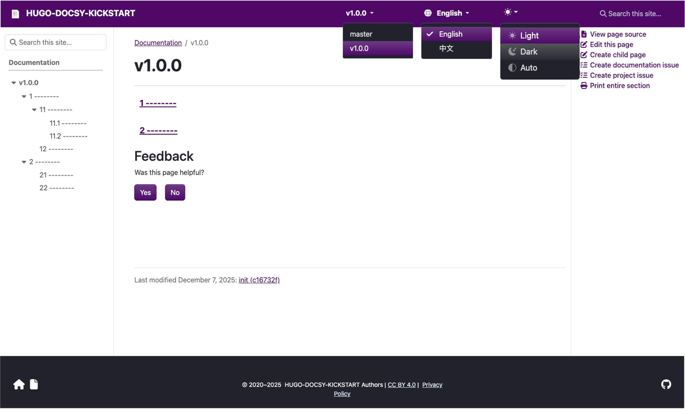
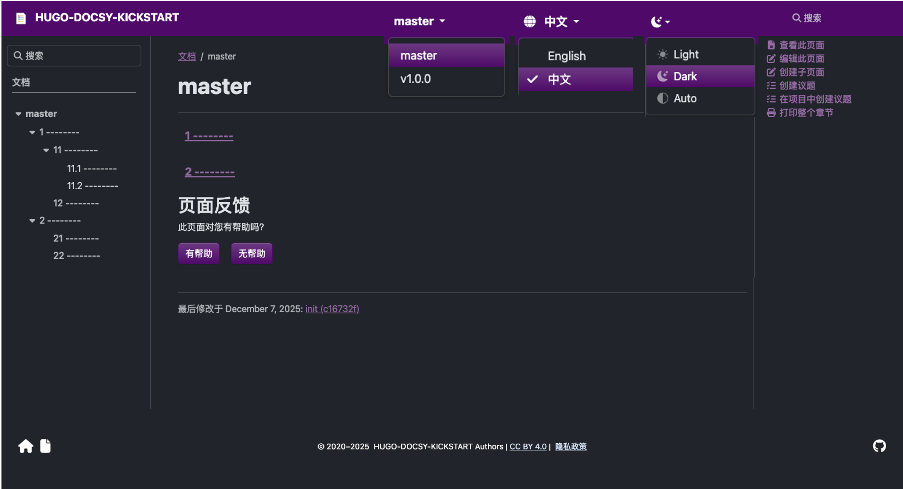

# Minimalist but Full-Featured​ docs server

Versioned, multi-language, searchable, auto-generated navigation, edit on github, PDF export, etc.
based on [hugo](https://gohugo.io/) and [docsy](https://www.docsy.dev/).

## Run Server
```bash
hugo server --bind 0.0.0.0 --baseURL http://localhost:1313/
```

then open browser at [localhost:1313/](http://localhost:1313/)

## Example






## Environment Requirements

- golang required >= 1.23.0
```bash
wget https://go.dev/dl/go1.23.0.linux-amd64.tar.gz

rm -rf /usr/local/go && tar -C /usr/local -xzf go1.23.0.linux-amd64.tar.gz

export PATH=$PATH:/usr/local/go/bin
```


- install hugo(hugo_extended)
```bash
wget https://github.com/gohugoio/hugo/releases/download/v0.146.0/hugo_extended_0.146.0_linux-amd64.tar.gz

tar -xzf hugo_extended_0.146.0_linux-amd64.tar.gz

cp hugo /usr/local/bin/
```

- devDependencies (only build required)
```bash
npm install -D postcss postcss-cli autoprefixer
```
